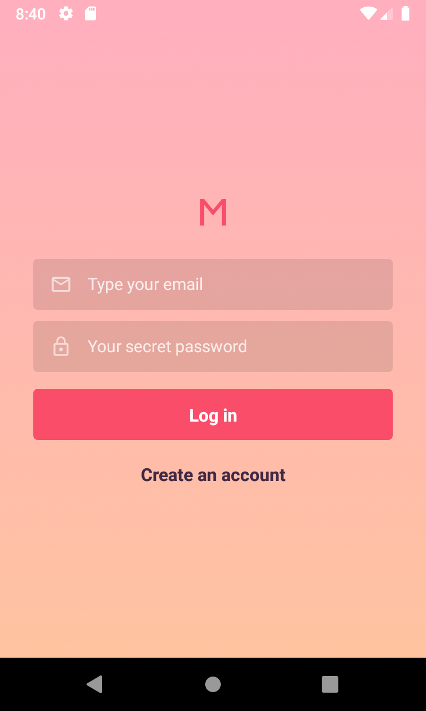
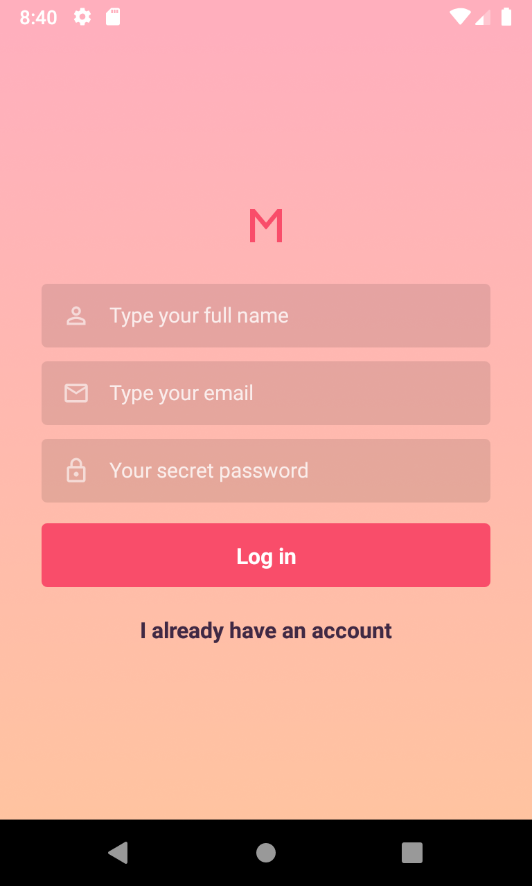
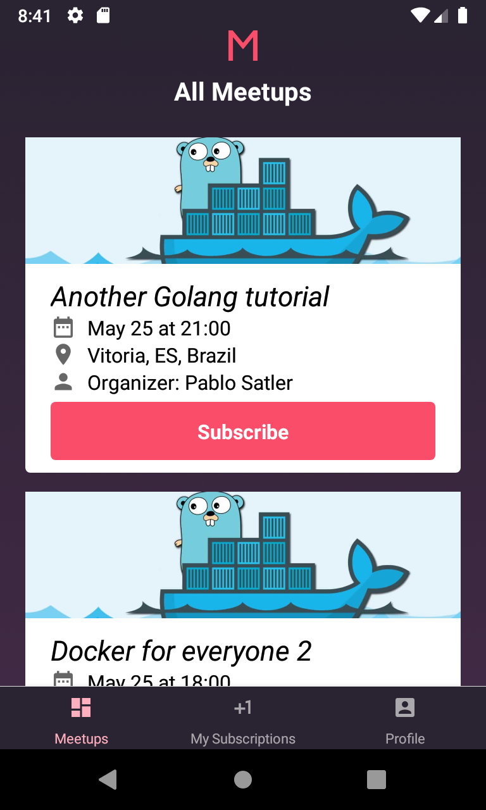
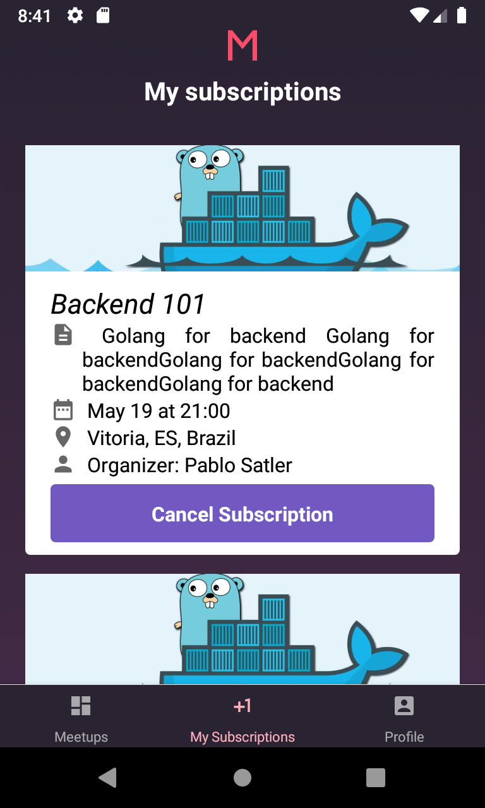
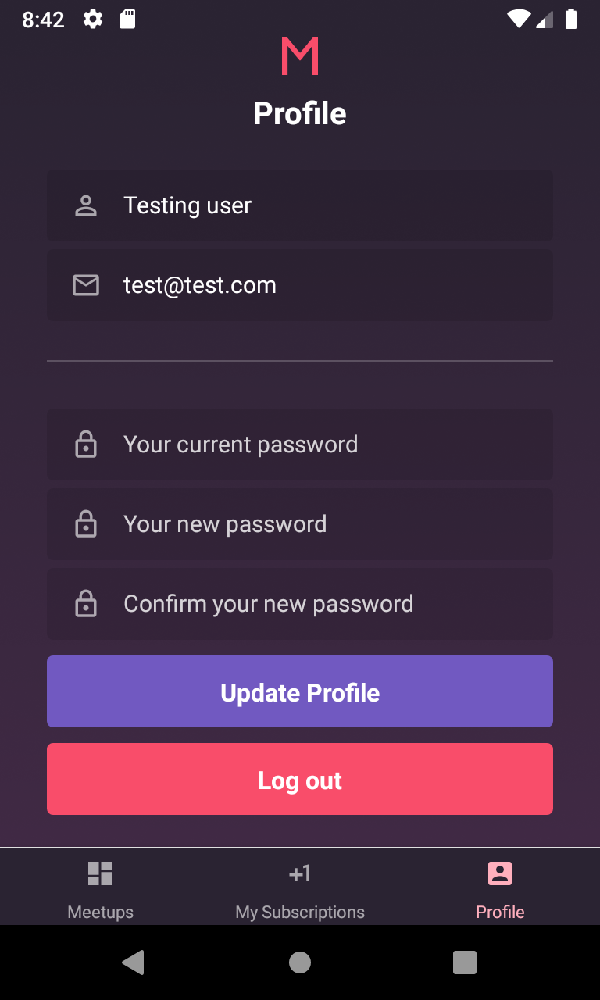

<p align="center">
  

  

  

  

  <a href="https://www.linkedin.com/in/pablosatler/">
    
  </a>

  

</p>

# Meetapp Mobile

> Mobile Frontend for users (in React Native) of the [meetapp backend app](https://github.com/psatler/meetapp-backend)

This application is built with the React Native CLI. It consumes the API implemented at [this repository](https://github.com/psatler/meetapp-backend).

This is the mobile frontend, where the user can subscribe to the meetups and see the meetups they have subscribed to.
The [web frontend](https://github.com/psatler/meetapp-frontend) is where the organizers can created meetups, filling out pieces of information such as meetup name, description and location as well as uploading a banner for it.

This app has tools configured such as ESLint, Redux, Redux Saga, Reactotron, Storybookjs. It also uses the Typescript template of React Native. It has some features implemented as
Infinite Scroll on the _Dashboard_ screen (the Home one) as well as _pull to refresh_ to refresh and update the list coming from the backend. The user can update their information
such as password, email and user name on the app at the _Profile_ screen.

### Table of Contents

- [How to Run](#running-the-app-via-usb)

- [Screens of the app](#screens-of-the-app)

  - [Authentication](#authentication)
  - [Registration](#registration)
  - [Dashboard](#dashboard)
  - [Subscriptions](#subscriptions)
  - [Profile](#profile)

- [Storybook](#storybook)

- [Some dependecies used](#some-dependecies-used)
- [Acknowledgements](#acknowledgements)
- [License](#license)

### Running the app via USB

**DISCLAIMER**: This was tested on an Android device only.

You got to have your phone with `Developer Options` enabled first.

To actually run the application on the phone:

```
npx react-native run-android
npx react-native start
```

You can check if the Android phone is connected by running:

```
adb devices
```

You can install Reactotron and use it to switch between the App screen and Storybook screens.

The following is usually used to get Reactotron connected to the application for debugging purposes:
```
adb reverse tcp:9090 tcp:9090
```
and then, reload the app with 'r'


### Screens of the app

At this section you can see some gifs of the app working and some screenshots as well. They were taken/recorded from
an Android Nexus 4 Simulator with the _Record and Playback_ option of the simulator and later **had its size reduced**, which
in turn made a decrease in the quality of them.


[Back to top](#meetapp-mobile)

##### Authentication

The user can authenticate in the app by email and password.


<!-- <p align="center">
  
</p> -->


[Back to top](#meetapp-mobile)

##### Registration

The user can register himself by inserting his name, email and password.


<!-- <p align="center">
  
</p> -->

[Back to top](#meetapp-mobile)

##### Dashboard

The user can browse through the meetups created and saved in the database as well as being able
to subscribe to a meetup.. This screen has an infinite scroll
implement to load more meetups when the end is reached. It also has a _pull to refresh_ feature.


<!-- <p align="center">
  
</p> -->

[Back to top](#meetapp-mobile)

##### Subscriptions

The user can visualize his/her subscriptions in the meetups, being able to cancel a subscription as well.


<!-- <p align="center">
  
</p> -->

[Back to top](#meetapp-mobile)

##### Profile

The user can edit his name, email and password registered in the system through this screen.


<!-- <p align="center">
  
</p> -->

[Back to top](#meetapp-mobile)

### Storybook

The application its components used displayed in the storybook. To be able to view them on the device, you need
Reactotron installed so you can leveraged its switcher between app and storybook. See below a recording of it


[Back to top](#meetapp-mobile)

### Some dependecies used

- [React Navigation v5](https://reactnavigation.org/)
- [Axios](https://github.com/axios/axios)
- [Date FNS](https://github.com/date-fns/date-fns)
- [Typesafe Actions](https://github.com/piotrwitek/typesafe-actions)
- [react-native-linear-gradient](https://github.com/react-native-community/react-native-linear-gradient)
- [Reactotron](https://github.com/infinitered/reactotron) for debugging
- [Redux Persist](https://github.com/rt2zz/redux-persist) for persisting the store info
- [Async Store](https://github.com/react-native-community/async-storage)
- [Storybook](https://storybook.js.org/)

[Back to top](#meetapp-mobile)
### Acknowledgements

Some acknowledments from this app such how to set up its configuration can be found at the [Acknowledments](https://github.com/psatler/meetapp-mobile/blob/master/Acknowledments.md) page.

[Back to top](#meetapp-mobile)
### License

This project is licensed under the terms of the [MIT License](https://opensource.org/licenses/MIT) © Pablo Satler 2020
